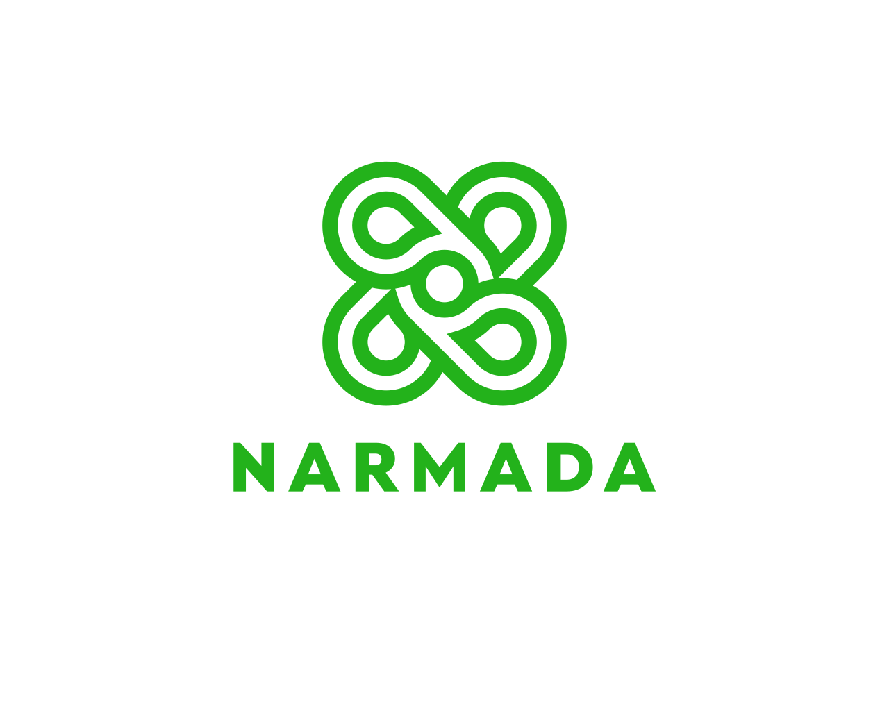

<p align="center">
  
</p>

<h3 align="center">Receipt tracker and expense report generator</h3>

<p align="center">
  Turn photos and e-receipts into reviewed, de-duplicated expense records, then
  export them as CSV. Runs entirely on your Mac.
</p>

<p align="center">
  <a href="#quick-start">Quick start</a> ·
  <a href="#how-it-works">How it works</a> ·
  <a href="#reports">Reports</a> ·
  <a href="#configuration">Configuration</a> ·
  <a href="#development">Development</a>
</p>

---

Narmada reads a receipt the way a bookkeeper would. It finds the paper in a
photo, straightens and cleans it, reads it with Tesseract OCR, and pre-fills the
date, merchant, category and total. **You review every receipt before anything is
saved**, so a creased or faded one never silently corrupts your records. Entries
land in a local SQLite database and export to CSV for a spreadsheet or your
accountant.

**Nothing leaves your machine.** There are no network calls anywhere in the
pipeline, including mailbox import: remote images referenced by email HTML are
never fetched.

## Highlights

| | |
| --- | --- |
| **Photos and e-receipts** | Add receipt photos directly, or import a Gmail `.mbox` export. HTML e-receipts are drawn as an image, so they are reviewed and read like any other receipt. |
| **Built for Indonesian receipts** | Tesseract's Indonesian model, `1.234.567,89` number formats, Indonesian month names and point-of-sale vocabulary. |
| **Rupiah and US dollars** | The currency is read off the receipt, shown in a dropdown you can correct, and decides how amounts and dates are interpreted. |
| **Human review, always** | Every OCR suggestion is editable and nothing is auto-committed. |
| **No double entries** | The same purchase saved twice updates one row instead of being counted twice. |
| **CSV reports** | Export any date range, with per-currency totals shown before you commit to a file. |
| **Receipt attachments** | A PDF for the same range: an index, then every receipt's image under a caption. For finance teams that want the receipt next to the figure. |
| **Self-contained app** | A macOS `.app` with OpenCV, Tesseract and the language models embedded. No Homebrew needed to run it. |

## Quick start

### Run the built app

Download the zipped `.app` from the repository's Releases page, unzip it and
open it. The release is built for Apple Silicon. The app is unsigned, so the
first launch needs right-click → **Open**. After copying it to another Mac you
may also need `xattr -dr com.apple.quarantine <path-to>.app`.

### Run from source

Requirements: macOS, Python 3.11+, and [Homebrew](https://brew.sh) for
Tesseract (the built app embeds its own copy).

```bash
brew install tesseract tesseract-lang
make setup     # creates .venv and installs everything from pyproject.toml
make run       # launches the app
```

`make` on its own lists every task. Without it, `.venv/bin/pip install -r
requirements.txt` and `.venv/bin/python main.py` do the same.

The pipeline code itself has no macOS-specific parts. The build tooling and app
bundling target macOS.

## How it works

1. **Add receipts.** **Add Images…** (⌘O) takes JPEG, PNG, TIFF, WebP and, with
   `pillow-heif` installed, HEIC. **Add from Mailbox…** (⌘M) imports a Gmail
   `.mbox` export.
2. **Process the queue.** **Process Queue** (⌘R) runs the pipeline one item at a
   time on a background thread, so the window stays responsive.
3. **Review each receipt.** The scan and the OCR text sit side by side with an
   entry form pre-filled below them. Correct anything, then **Save & Next** (⌘S)
   moves to the next unreviewed receipt. The app asks before letting you quit
   with receipts still unreviewed.
4. **Export.** **Report → Generate Report…** (⌘E) writes a CSV for a date range.

The OCR panel is editable. Select text in it and click **Name**, **Amount** or
**Date** to drop the selection into that field, which helps when the automatic
guess picks the wrong line.

## Reports

**Report → Generate Report…** (⌘E) exports saved entries over a date range. The
dialog shows how many entries the range covers and what they add up to before you
commit to a file, with presets for this month, last month, this year and
everything on record.

```csv
Date,Category,Expense Detail,Amount,Currency
2026-06-16,Makanan & Minuman,Warung Contoh,70000.00,IDR
2026-07-14,Transportasi,Ride Example,44000.00,IDR
2026-08-17,Tagihan & Utilitas,Example VPN,56.48,USD
```

- Both ends of the range are inclusive. Dates may be typed in any format the
  entry form accepts (`2026-07-01`, `01/07/2026`), and a reversed range is
  swapped rather than rejected.
- Photos and e-receipts appear alike, because the report is about the expense and
  not where it came from.
- Entries saved without a date are left out, since they cannot fall inside a
  range.
- The file is UTF-8 with a BOM so Excel renders Indonesian text correctly, and
  amounts are unformatted so a spreadsheet can sum the column directly.
- Totals are kept **per currency** (`IDR 69,000 · USD 76.48`), because adding
  rupiah to dollars means nothing. No total row is appended, which would get in
  the way of sorting and filtering.

### Receipt attachments

**Report → Generate Receipt Attachments (PDF)…** (⇧⌘E) writes one PDF for a date
range, for finance teams that want the receipts alongside the figures. It uses the
same range picker as the CSV, and leaves the CSV export exactly as it was.

- **An index, then a page per receipt.** The index lists every entry with its page
  number and the per-currency totals. Each receipt page carries a caption (its
  position, date, category, merchant, amount and entry ID) above the image.
  Entries come in the same order as the CSV rows, so entry 12 in the PDF is row 12
  in the spreadsheet.
- **Every entry has a picture.** Photos and e-receipts use their stored scan.
  Entries saved before e-receipts were rendered have none, so those are drawn again
  from their original mailbox, matched by Message-ID, exactly as a fresh import
  would draw them. If that mailbox has moved, the page says "No image on file" and
  shows the stored text, so no entry silently drops out. The dialog previews how
  many of each before you export.
- **A receipt too tall to read on one page** continues over the next.
- **Read-only.** Nothing is saved to your scan folder or database, and a mailbox
  is only read. The export runs in the background with a progress bar and can be
  cancelled; the file is written only once it is complete.
- **Small and private.** Pages are 1-bit A4 at 200 dpi, so about 170 receipts come
  to a few megabytes, and the PDF carries no author or other personal metadata.

## Mailbox import

A mailbox holds two kinds of receipt, and each takes the path that suits it:

- **Messages with an attached photo.** Each image is written to
  `<output_dir>/../email_attachments/` and goes through the full OpenCV and
  Tesseract pipeline, unchanged. One queue item per attachment.
- **HTML e-receipts with no image** (ride-hailing, food delivery, airline
  confirmations). The markup is drawn as an image and read back by OCR like any
  other receipt, so the review step always has something to check the suggested
  figures against. These show in the queue with a `✉` prefix.

The renderer works from table rows and keeps each row's cells apart, because HTML
receipts put a label and its amount in sibling cells. A two-cell row is drawn
label-left and value-right on one baseline, reproducing structure that a
line-oriented reader would otherwise have to infer. It uses Pillow only, with no
browser engine, so there is nothing extra to bundle and no way for a render to
reach the network.

The trade-off is worth stating plainly: the renderer draws text the app already
holds, so OCR re-reads its own drawing and cannot beat parsing that text
directly. What it buys is a picture to review against, and that two-cell layout
rule. Measured on a five-receipt sample mailbox it reads back at about 93% mean
confidence and extracts date, category, merchant and amount identically to the
older text-only path.

Two deliberate limits:

- **Remote images are never fetched.** `` in a marketing
  email is a logo or a tracking pixel, and the app makes no network calls. Only
  real attachments are read.
- **Image parts under 8 KB are ignored** as logos, signature images and spacers.
  Tune with `min_attachment_bytes` in `mail.iter_mbox`.

`.mbox` parsing needs no third-party library. Python's `mailbox` and `email`
modules handle the format, and BeautifulSoup is used only to reduce an HTML body
to rows of cells.

## Currency

The currency is detected first, by counting `Rp`/`IDR`/`rupiah` against
`$`/`US$`/`USD` (a tie falls back to the configured default). It then changes two
rules:

- **Amounts.** A rupiah total is never under 100, so smaller numbers are treated
  as quantities. A dollar total can be `0.99`, so it must instead carry cents or
  sit on a line that names the currency.
- **Numeric dates.** Day-first for rupiah and month-first for dollars
  (`03/04/2026` is 3 April or March 4), each falling back to the other when the
  first reading is impossible. Written months such as `Aug 17, 2026` parse either
  way.

The currency is a dropdown in the review form, so a wrong guess is one click to
correct.

## Duplicates

An entry is identified by **title + amount + currency + date**. Saving a second
entry with the same four values updates the existing row (same `id`, original
`created_at`, notes kept if the new entry has none) instead of adding another.
This holds across sessions and across sources, so re-importing a mailbox, or
filing one purchase from both a photo and an email, gives one row. The status bar
tells you when a save updated an existing entry.

- Titles compare ignoring case, width and extra whitespace. Amounts compare as
  whole cents, so `44000` and `44000.00` match.
- An entry with no title, amount or date is never merged. Two untitled receipts
  that share an amount and a day are not evidence of one purchase.
- Editing a saved entry so that it matches a *different* row merges the two onto
  that row.
- The rule is enforced by a unique index, not only by the app. Opening a database
  from an older version **backs it up first** (`receipts.db.bak-YYYYMMDD-HHMMSS`
  beside it), then folds existing duplicates into the oldest row of each group in
  one transaction. If anything fails, nothing is changed.

Limits worth knowing: the title is part of the key, so the same charge titled two
different ways is two entries. A refund or void with the same title, amount and
date as the original merges into it instead of cancelling it. The date used when
a receipt prints none is the email's own header date, which carries that header's
timezone.

## Configuration

Settings live in `config.json`, created on first run from `config.default.json`.
From source it sits next to the code. In the built app it lives at
`~/Library/Application Support/ReceiptScanner/config.json`. Set the
`RECEIPTSCANNER_CONFIG` environment variable to point somewhere else.

```json
{
  "output_dir": "~/Documents/ReceiptScanner/scans",
  "database_path": "~/Documents/ReceiptScanner/receipts.db",
  "copy_originals": false,
  "currency": "IDR",
  "currencies": ["IDR", "USD"],
  "categories": ["Makanan & Minuman", "Transportasi", "..."],
  "ocr": { "lang": "ind", "psm": 6, "oem": 3 }
}
```

| Key | Meaning |
| --- | --- |
| `currency` | Default for a receipt that prints none. |
| `currencies` | Choices in the review form's currency dropdown. |
| `categories` | Choices in the category dropdown. |
| `ocr.lang` | Any installed Tesseract language: `ind`, `eng`, or `ind+eng`. |
| `preprocess` | Every image-pipeline knob. The defaults were tuned against real receipt photos and are a reasonable starting point. |

The file is written as a complete snapshot of the defaults, so it stays readable
and editable. That also means a `config.json` from an older version keeps that
version's values. Delete it to regenerate from the current defaults.

The app's data directory keeps the name `ReceiptScanner` for compatibility with
existing installs.

## Data storage

One table, `receipts`, at `database_path`. Alongside each reviewed entry
(`entry_date`, `category`, `name`, `amount`, `currency`, `notes`) a row keeps the
original photo path, the scanned image path, the raw and as-reviewed OCR text, and
image details: dimensions, byte size, SHA-256, EXIF capture time, camera make and
model, whether a page was detected, and the deskew angle.

`source_kind` records where a row came from: `image` (a photo you added),
`email_image` (a photo attached to a message) or `email_render` (an e-receipt
drawn from its markup). Rows written before the render path existed carry the
legacy value `email`. Email rows also carry `email_message_id`, `email_subject`,
`email_from` and `email_date`. Databases created by older versions are migrated in
place on open.

```bash
sqlite3 ~/Documents/ReceiptScanner/receipts.db \
  "SELECT entry_date, category, name, amount, currency FROM receipts ORDER BY entry_date;"
```

## Under the hood

```
load (EXIF-rotated, HEIC-aware)
  → find the page          brightness/edge/saturation segmentation, scored by
                           how much brighter the region is than its surroundings
  → straighten + crop      minimum-area rectangle, so text is never sheared
  → blank the background   table texture never reaches the threshold step
  → normalise size         downscaling averages away paper grain
  → flatten lighting       divide out the background to erase shadows
  → denoise → sharpen
  → adaptive threshold     → despeckle → pad
  → Tesseract (lang=ind)
  → suggest date / category / name / amount / currency
```

Two choices are the opposite of the textbook recipe, and both were measured
rather than guessed:

- **Detection runs on a ~700px copy.** At full resolution the printed text
  carries more edge energy than the page border, and the outline is never found.
- **The page is straightened with its minimum-area rectangle, not a four-point
  perspective warp.** Corners recovered from an approximated contour are
  imprecise enough that the warp shears the text, costing more accuracy than the
  perspective it corrects.

Measured on four sample photos by OCR recall of known strings, tuning took recall
from 0.00 to 0.86, mean confidence from 19% to 64%, and spurious "words" per
receipt from 830 to 160.

**Field extraction** is tuned for Indonesian receipts. The total is picked by
keyword tier (`GRAND TOTAL` > `TOTAL` > `SUBTOTAL`/`TUNAI`), with the longest
matching keyword deciding the tier so `SUBTOTAL` is never mistaken for the grand
total. Long unformatted digit runs are ignored, which keeps card and merchant
numbers out of the amount field. Every value is only a suggestion: the review
step exists because OCR on a creased receipt will sometimes be wrong.

## Development

### Tests

```bash
make test-fast    # ~5 s, needs no Tesseract, display or data/
make test         # everything this machine can run (~1 minute)
```

(`make test-fast` is `pytest -m "not ocr and not gui and not fixtures"`, and
`make test` is a plain `pytest`; the configuration lives in `pyproject.toml`.)

The `ocr`, `gui` and `fixtures` groups skip themselves when Tesseract, a display
or private sample data is missing, so a plain `pytest` is green on a fresh clone.
Every test runs against a throwaway home directory and config, so none of them
can touch `~/Documents/ReceiptScanner`.

To check a change to the extraction logic against your own receipts, run
`python tests/make_golden.py` *before* the change and `pytest -m fixtures` after.
It reports each receipt whose date, category, name, amount or currency changed.

`data/` is not tracked in git, because real receipts and mailbox exports carry
names, card digits, tax IDs and addresses. Drop your own photos or a `.mbox`
export in there to use the checks below.

### Headless check

Exercise the whole pipeline without the GUI. It accepts photos and `.mbox` files
alike:

```bash
.venv/bin/python main.py --self-test                     # engine and resource checks only
.venv/bin/python main.py --self-test data/*.jpeg         # receipt photos
.venv/bin/python main.py --self-test data/Unread.mbox    # every receipt in a mailbox
```

With no arguments it works on a fresh clone and still verifies that Tesseract and
the language models resolve.

### Building the app

```bash
make build      # dist/ReceiptScanner.app
make verify     # prove it is self-contained
make package    # dist/ReceiptScanner-v<version>-macos-<arch>.zip
make clean      # remove build output
```

`make build` runs PyInstaller on `ReceiptScanner.spec` and produces
`dist/ReceiptScanner.app` (~182 MB) with OpenCV, the Tesseract binary and its
dylibs, and the `ind` and `eng` models embedded, so it runs on a Mac with neither
Homebrew nor Tesseract installed. Edit `BUNDLE_LANGUAGES` in the spec to change
which models ship.

`make verify` runs the built app's self-test with Homebrew off the `PATH` and a
throwaway home directory, which proves it is using the embedded copies and cannot
touch your own data. `make clean` removes `build/`, `dist/`, caches and
`__pycache__` folders, and leaves `.venv`, `data/` and your configuration alone.

The Dock icon is generated at build time from `assets/logo-app.png`, the single
master. The spec adds the standard macOS margin around it and writes every
required size, so replacing that one PNG is all it takes to change the icon.

### Releasing

The version is defined once, as `__version__` in `receiptscanner/__init__.py`.
`pyproject.toml`, the `.app` bundle and the release tag all follow it. To publish:

1. Bump `__version__`, commit, and push to `master`.
2. Run `make release`.

`make release` refuses to start unless you are on `master`, have no uncommitted
changes, are level with `origin/master`, and the tag `v<version>` does not already
exist, locally or on GitHub. It then runs the tests, builds, verifies and zips the
app, shows what it is about to publish, and **asks before it touches GitHub**.
Answering `y` runs `gh release create` with the zip attached, targeting the pushed
commit. It needs the [GitHub CLI](https://cli.github.com) (`brew install gh`,
then `gh auth login`).

Options go in the environment:

```bash
DRAFT=1 make release                    # create a draft to review on GitHub first
NOTES=notes.md make release             # release notes from a file (default: generated)
TITLE="v1.2.0 — new thing" make release # custom title (default: the tag)
YES=1 make release                      # skip the confirmation question
```

The zip is built for the architecture of the machine that builds it, so a release
made on Apple Silicon is `macos-arm64`.

### Project layout

| Path | Purpose |
| --- | --- |
| `main.py` | Entry point; also `--self-test` |
| `receiptscanner/config.py` | Config loading, path resolution |
| `receiptscanner/resources.py` | Finds Tesseract and tessdata, frozen or not |
| `receiptscanner/imaging.py` | OpenCV pipeline |
| `receiptscanner/mail.py` | `.mbox` reading, attachment extraction, HTML → rows |
| `receiptscanner/render.py` | Draws an e-receipt's markup as an image for OCR |
| `receiptscanner/ocr.py` | Tesseract wrapper |
| `receiptscanner/parsing.py` | OCR text → date, category, name, amount, currency |
| `receiptscanner/pipeline.py` | Ties the stages together |
| `receiptscanner/db.py` | SQLite storage, the de-duplication key, schema migrations |
| `receiptscanner/report.py` | CSV export, date-range presets, shared money formatting |
| `receiptscanner/attachments.py` | PDF of the receipt images behind a report |
| `receiptscanner/app.py` | tkinter UI |
| `tests/` | pytest suite |
| `assets/` | Brand logo and the app-icon master |
| `ReceiptScanner.spec` | PyInstaller build |
| `pyproject.toml` | Project metadata, pinned dependencies, test configuration |
| `Makefile` | `setup`, `run`, `test`, `clean`, `build`, `verify`, `package`, `release` |
| `scripts/release.sh` | The guarded GitHub release behind `make release` |

## License

[MIT](LICENSE) © 2026 Aldrich Halim
